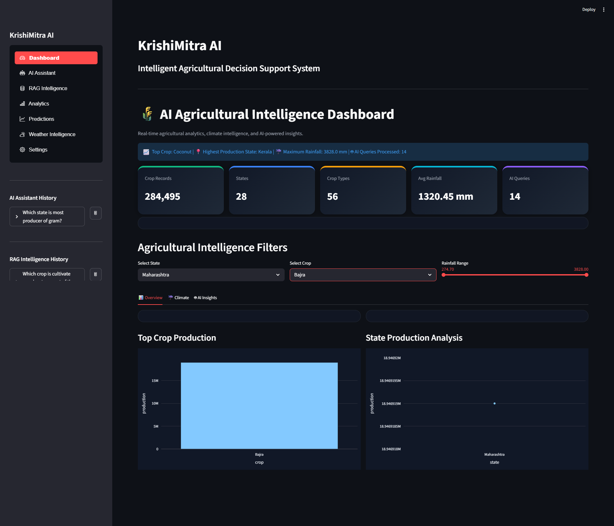
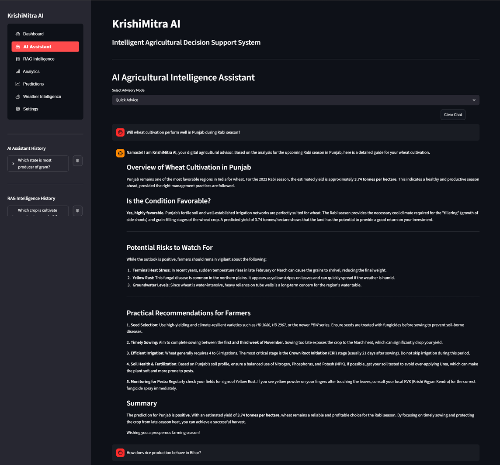
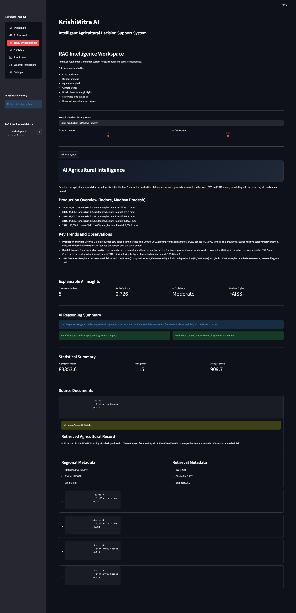
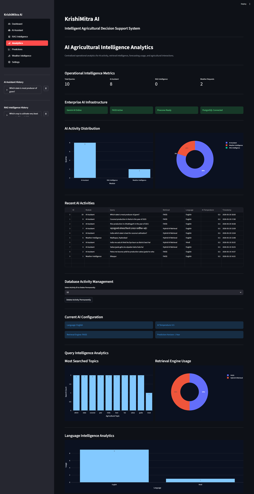
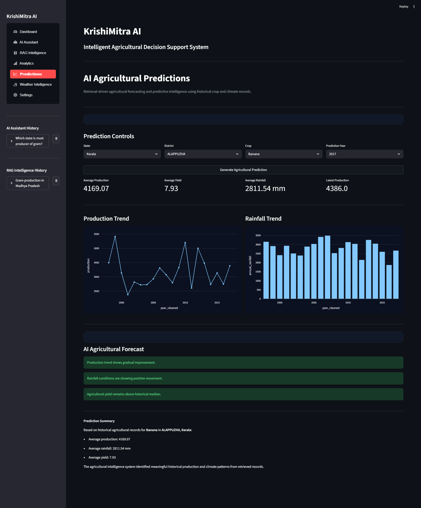
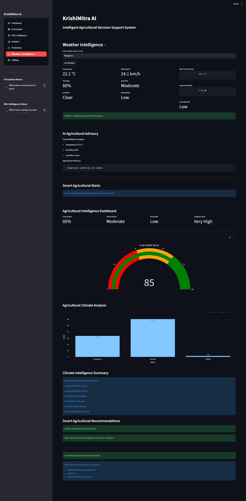
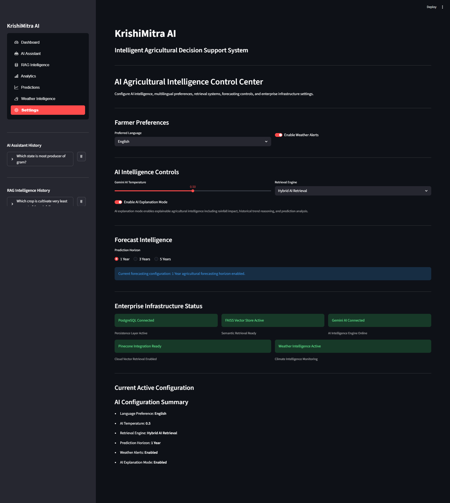

# 🌾 KrishiMitra AI

## Intelligent Agricultural Decision Support System

KrishiMitra AI is an AI-powered agricultural intelligence platform that combines Retrieval-Augmented Generation (RAG), semantic search, machine learning forecasting, climate intelligence, and large language models to support data-driven agricultural decision-making.

The platform transforms large-scale agricultural and climate datasets into actionable insights through hybrid vector retrieval, predictive analytics, explainable AI, multilingual assistance, and real-time weather intelligence.

---

## Overview

KrishiMitra AI is designed for farmers, researchers, agribusiness professionals, and policymakers to explore agricultural data, understand climate patterns, forecast production trends, and obtain AI-generated recommendations.

### Core Capabilities

- AI Agricultural Assistant
- Retrieval-Augmented Generation (RAG)
- Hybrid Retrieval Architecture (FAISS + Pinecone)
- Semantic Agricultural Search
- Explainable AI Insights
- Agricultural Production Forecasting
- Real-Time Weather Intelligence
- Climate Analytics
- PostgreSQL Activity Tracking
- Interactive Analytics Dashboards
- Multilingual Agricultural Assistance

---

## Dataset Scale

The system is powered by large-scale agricultural and climate datasets.

| Dataset | Records |
|----------|----------|
| Agricultural Production Records | 446,301+ |
| Climate Intelligence Records | 284,495+ |
| Total Agricultural Records | 730,000+ |

---

## Technology Stack

| Category | Technologies |
|-----------|-------------|
| Frontend | Streamlit |
| AI & LLMs | Gemini AI, LangChain |
| Retrieval | Retrieval-Augmented Generation (RAG) |
| Vector Databases | FAISS, Pinecone |
| Machine Learning | Scikit-learn |
| Database | PostgreSQL |
| Data Processing | Pandas, NumPy |
| Visualization | Plotly, Matplotlib |
| Embeddings | SentenceTransformers |
| Weather Intelligence | WeatherAPI |
| Backend | Python |

---

# System Architecture

```text
User Query
    │
    ▼
Query Processing Layer
    │
    ▼
Language Intelligence Engine
    │
    ▼
Embedding Generation
    │
    ▼
FAISS + Pinecone Retrieval
    │
    ▼
Relevant Agricultural Context
    │
    ▼
Gemini AI Reasoning Engine
    │
    ▼
Statistical Analysis Layer
    │
    ▼
Machine Learning Forecasting
    │
    ▼
Weather Intelligence Engine
    │
    ▼
PostgreSQL Analytics Storage
    │
    ▼
Interactive Dashboard Response
```

---

# Application Preview

---

## Dashboard

Centralized agricultural intelligence dashboard providing crop analytics, production insights, rainfall intelligence, and interactive visualizations.



---

## AI Assistant

Conversational agricultural advisor powered by Gemini AI, semantic retrieval, multilingual intelligence, and contextual agricultural recommendations.



---

## RAG Intelligence Workspace

Retrieval-Augmented Generation system enabling semantic agricultural search, explainable AI insights, contextual intelligence, source transparency, and knowledge discovery.



---

## Analytics

Enterprise-grade analytics dashboard for AI activity monitoring, retrieval intelligence tracking, query analytics, infrastructure monitoring, and operational insights.



---

## Predictions

Machine learning forecasting engine supporting crop production prediction, rainfall analysis, yield forecasting, historical trend analysis, and agricultural intelligence.



---

## Weather Intelligence

Real-time agricultural weather monitoring with climate intelligence, rainfall analytics, crop health assessment, irrigation recommendations, and weather advisory generation.



---

## Settings

Centralized AI control center supporting multilingual preferences, retrieval engine selection, AI configuration, forecasting controls, weather alerts, and infrastructure monitoring.



---

# AI Agricultural Assistant

The AI Assistant enables natural language interaction with agricultural intelligence systems.

### Features

- Agricultural Question Answering
- Context-Aware Recommendations
- Historical Agricultural Analysis
- Crop Advisory Intelligence
- Climate-Aware Insights
- Multilingual Assistance
- Semantic Agricultural Retrieval

---

# Retrieval-Augmented Generation (RAG)

KrishiMitra AI integrates Retrieval-Augmented Generation to provide contextual agricultural intelligence using large-scale agricultural datasets.

### Capabilities

- Semantic Search
- Embedding-Based Retrieval
- Agricultural Knowledge Discovery
- Explainable AI Responses
- Source Transparency
- Similarity-Based Ranking
- Context-Aware Response Generation

### Retrieval Engines

- FAISS Vector Database
- Pinecone Cloud Vector Database
- Hybrid Retrieval Configuration

---

# Agricultural Analytics

The analytics module provides enterprise-level visibility into platform intelligence and user activity.

### Analytics Features

- Query Intelligence Monitoring
- Retrieval Engine Usage Analytics
- Language Intelligence Analytics
- Activity Tracking
- AI Usage Metrics
- Infrastructure Monitoring
- Database Activity Management

---

# Agricultural Forecasting

Machine learning forecasting modules provide predictive agricultural intelligence.

### Forecasting Features

- Crop Production Prediction
- Yield Forecasting
- Rainfall Trend Analysis
- Historical Performance Evaluation
- Agricultural Trend Detection
- Predictive Intelligence Generation

---

# Weather Intelligence System

Real-time climate intelligence designed for agricultural decision-making.

### Capabilities

- Live Weather Monitoring
- Agricultural Climate Analysis
- Rainfall Intelligence
- Crop Health Assessment
- Heat Risk Monitoring
- Irrigation Recommendations
- Smart Agricultural Alerts

---

# PostgreSQL Integration

The platform utilizes PostgreSQL as its operational intelligence layer.

### PostgreSQL Usage

- AI Assistant Conversation History
- RAG Query Tracking
- Weather Intelligence Activity Logging
- Analytics Persistence
- User Activity Monitoring
- Query Intelligence Reporting
- Enterprise Activity Management

---

# Multilingual Support

KrishiMitra AI supports multiple Indian languages for broader agricultural accessibility.

### Supported Languages

- English
- Hindi
- Telugu
- Marathi
- Tamil

---

# Project Structure

```text
Intelligent-Agricultural-Decision-Support-System/
│
├── assets/
│   ├── dashboard.png
│   ├── ai_assistant.png
│   ├── rag_intelligence.png
│   ├── analytics.png
│   ├── predictions.png
│   ├── weather_intelligence.png
│   └── settings.png
│
├── api/
├── database/
├── data/
├── data_pipeline/
├── data_processing/
├── ml_models/
├── rag/
├── rag_workspace/
├── utils/
├── visualization/
│
├── app.py
├── requirements.txt
├── README.md
└── .env.example
```

---

# Installation

## Clone Repository

```bash
git clone https://github.com/Rajjuram07/Intelligent-Agricultural-Decision-Support-System.git

cd Intelligent-Agricultural-Decision-Support-System
```

---

## Create Virtual Environment

### Windows

```bash
python -m venv krishimitra_env

krishimitra_env\Scripts\activate
```

### Linux / Mac

```bash
python3 -m venv krishimitra_env

source krishimitra_env/bin/activate
```

---

## Install Dependencies

```bash
pip install -r requirements.txt
```

---

## Configure Environment Variables

Create a `.env` file in the project root directory.

```env
# Gemini
GEMINI_API_KEY=your_gemini_api_key

# Weather API
WEATHER_API_KEY=your_weather_api_key

# PostgreSQL
DB_HOST=localhost
DB_PORT=5432
DB_NAME=krishimitra
DB_USER=postgres
DB_PASSWORD=your_password

# Pinecone
PINECONE_API_KEY=your_pinecone_api_key
PINECONE_ENVIRONMENT=your_environment
PINECONE_INDEX_NAME=your_index_name
```

---

## Run Application

```bash
streamlit run app.py
```

---

# Enterprise Design Principles

KrishiMitra AI follows scalable and modular AI engineering practices.

### Design Principles

- Modular Architecture
- Retrieval-Augmented Intelligence
- Explainable AI Workflows
- Scalable Vector Retrieval
- Database-Backed Persistence
- Reusable Processing Pipelines
- Separation of Concerns
- Enterprise Analytics Monitoring

---

# Use Cases

- Smart Farming Systems
- Agricultural Intelligence Platforms
- Climate-Aware Decision Support
- Crop Production Forecasting
- Agricultural Research Analytics
- Government Agricultural Programs
- AI-Assisted Farming Advisory Systems

---

# Future Enhancements

- Advanced Crop Disease Intelligence
- Satellite Imagery Analytics
- IoT Sensor Integration
- Voice-Based Farmer Assistant
- Mobile Application Development
- Government Scheme Recommendation Engine
- Smart Irrigation Intelligence
- Advanced Hybrid Retrieval Ranking
- Reinforcement Learning-Based Advisory System

---

# Project Strengths

- 730K+ Agricultural & Climate Records
- Hybrid Retrieval Architecture (FAISS + Pinecone)
- Retrieval-Augmented Generation Pipeline
- Gemini-Powered Agricultural Intelligence
- Explainable AI Recommendations
- Machine Learning Forecasting Engine
- Real-Time Weather Intelligence
- PostgreSQL Analytics Infrastructure
- Interactive Agricultural Dashboards
- Multilingual Farmer Support

---

# Author

**Rajjuram Goyal**

MCA | Data Science & Generative AI Enthusiast

GitHub:

https://github.com/Rajjuram07

Repository:

https://github.com/Rajjuram07/Intelligent-Agricultural-Decision-Support-System

---

# License

This project is intended for educational, research, and agricultural innovation purposes.

MIT License

---

⭐ If you find this project useful, consider starring the repository.